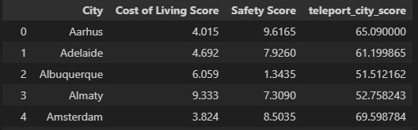

# Teleport City Scores

This project utilizes data from Teleport.org, focusing on 266 of the world's most livable and creative cities. The goal is to provide a comprehensive tool to compare and evaluate the cities based on several key metrics, making it easier for users to select their next travel or relocation destination.

## Overview

This tool leverages data on overall Teleport scores, safety ratings, and cost of living indices. These are some of the key factors that influence one's decision to live or visit a particular city. The data-driven insights provided by the tool can be instrumental in helping users make more informed choices.

## Process

Here are the key steps I followed to create this list:

1. **Data Extraction:** I used Python to extract data from the Teleport API. 

2. **Data Compilation:** The relevant metrics were gathered into a pandas DataFrame and then exported to a CSV file for further processing.

## Summary

"City Scores," is an interactive tool that bridges the gap between raw city data and helps complete informed decisions for travel or relocation. By leveraging the power of modern data technologies, it takes into account factors such as safety, cost of living, and overall city scores to aid users in their decision-making process. With an intuitive interface and rich, I believe this tool can be a valuable resource for anyone interested in exploring, comparing, and understanding the key characteristics of some of the world's most livable and creative cities.